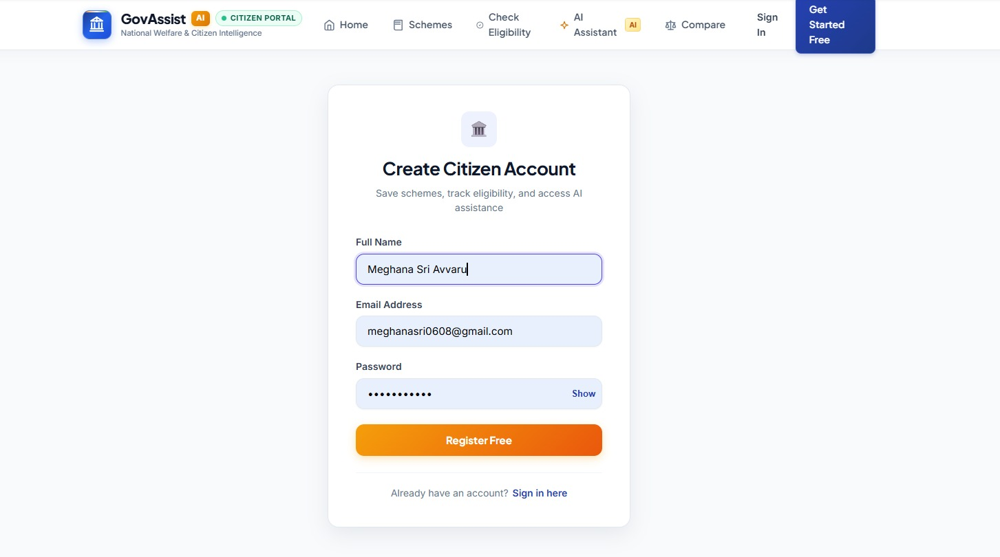
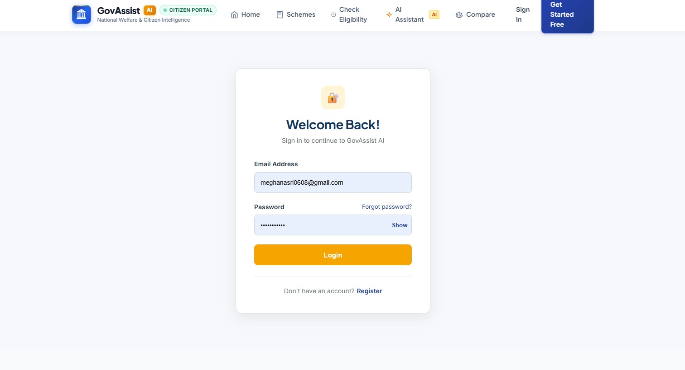
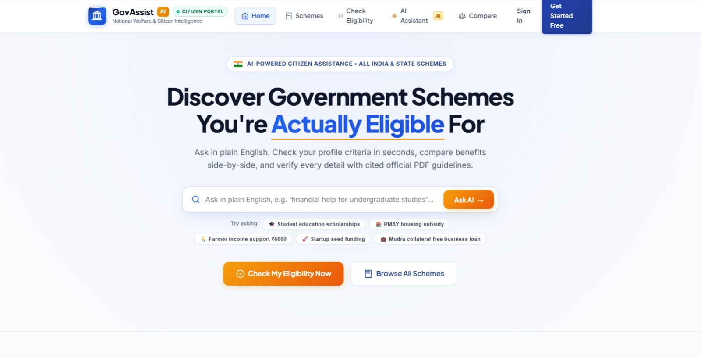
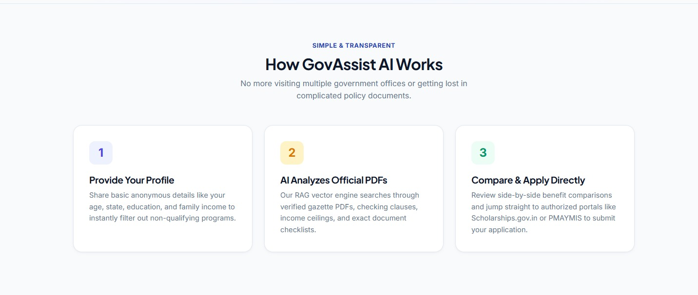
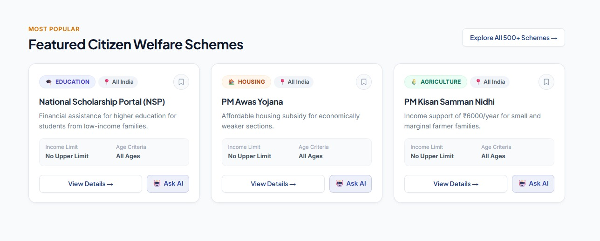
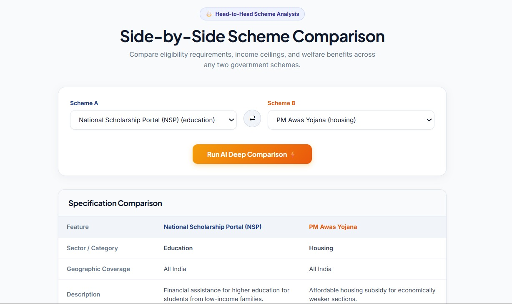

# 🏛️ GovAssist AI

### National Welfare & Citizen Intelligence Platform

AI-powered citizen assistance for discovering, understanding, and comparing Indian government welfare schemes — grounded in official PDF guidelines, not guesswork.

---

## 💡 Why GovAssist AI?

Most citizens never find out which government schemes they actually qualify for.
Scheme guidelines are scattered across dense, jargon-heavy official PDFs.
GovAssist AI reads those PDFs for you, and answers in plain English — with exact page citations.

---

## ✨ Features

| | |
|---|---|
| 🧠 **AI Chat Assistant** | Ask eligibility questions in plain English, get grounded answers with cited PDF pages. |
| 📋 **Eligibility Checker** | Enter your profile once, instantly see which schemes you qualify for. |
| ⚖️ **Compare Schemes** | Side-by-side AI comparison of benefits, eligibility, and best-fit use case. |
| 🔍 **Scheme Explorer** | Browse 500+ central & state schemes across Education, Housing, Agriculture, Employment, Startup, and Healthcare. |
| 📄 **Verified Citations** | Every AI answer is backed by exact PDF page excerpts — no hallucinated policy details. |
| 🛠️ **Admin RAG Console** | Upload official scheme PDFs; auto-chunked, embedded, and indexed in real time. |
| 🔐 **Secure Accounts** | JWT-based auth, saved schemes, and personal consultation history. |
| 🌍 **Always On** | No office visits, no appointments — instant answers, any time. |

---

## 📸 Screenshots

### Register


### Login


### Home


### Working Demo


### Schemes Explorer


### Browse by Category


### AI Assistant


### AI Scheme Assistant


### AI Chat Analysis


### Compare Schemes


### Admin — Uploading PDFs


---

## 🏗️ Architecture

```
┌─────────────────────────────────────────────────────────┐
│                      GOVASSIST AI                        │
└─────────────────────────────────────────────────────────┘
         │
         ▼
  ┌──────────────┐    HTTPS    ┌──────────────────┐
  │   Frontend   │ ──────────► │  FastAPI Backend │
  │  React + Vite│ ◄────────── │     (Python)      │
  └──────────────┘             └─────────┬─────────┘
                                          │
                     ┌────────────────────┼────────────────────┐
                     ▼                    ▼                    ▼
              ┌─────────────┐     ┌──────────────┐     ┌──────────────┐
              │  Gemini AI  │     │   Qdrant     │     │  PostgreSQL  │
              │  (RAG + LLM)│     │ Vector Store │     │  / SQLite DB │
              └─────────────┘     └──────────────┘     └──────────────┘
```

**Ingestion pipeline:** PyMuPDF extracts text & page metadata → chunked into ~700-character passages (100-char overlap) → embedded into 768-dim vectors → indexed in Qdrant with cosine similarity for real-time, cited retrieval.

---

## ⚙️ Tech Stack

| Layer | Technology |
|---|---|
| Frontend | React · Vite · React Router |
| Backend | Python · FastAPI · SQLAlchemy |
| AI / RAG | Google Gemini · PyMuPDF |
| Vector DB | Qdrant (Cloud) |
| Database | PostgreSQL (prod) · SQLite (local dev) |
| Auth | JWT |
| Hosting | Render (backend) · Vercel (frontend) |

---

## 🚀 Quick Start

```bash
# Clone
git clone https://github.com/MeghanaSri-A/GovAssist-AI.git
cd GovAssist-AI

# ── Backend ──
cd backend
python -m venv venv
source venv/bin/activate        # Linux/macOS
# venv\Scripts\activate         # Windows

pip install -r requirements.txt
cp .env.example .env
# Fill in GEMINI_API_KEY, QDRANT_HOST, QDRANT_API_KEY, DATABASE_URL, SECRET_KEY

uvicorn app.main:app --reload
# → http://localhost:8000

# ── Frontend (new terminal) ──
cd frontend
npm install
npm run dev
# → http://localhost:5173
```

### Required environment variables

| Variable | Required | Description |
|---|---|---|
| `GEMINI_API_KEY` | Yes | API key for Google Gemini (chat, compare, embeddings). |
| `QDRANT_HOST` | Yes | Qdrant Cloud cluster hostname. |
| `QDRANT_PORT` | Yes | Qdrant port (default `6333`). |
| `QDRANT_API_KEY` | Yes | Qdrant Cloud API key. |
| `DATABASE_URL` | Yes | PostgreSQL connection string in production; SQLite path locally. |
| `SECRET_KEY` | Yes in production | Signs JWT auth tokens. Must be set via your hosting platform's environment config, never committed. |

Generate a strong `SECRET_KEY` with:
```bash
python -c "import secrets; print(secrets.token_hex(32))"
```

---

## 📁 Project Structure

```
GovAssist-AI/
├── frontend/
│   ├── src/
│   │   ├── components/      ← Reusable UI (SearchBar, ChatBox, SchemeCard...)
│   │   ├── pages/            ← Home, Chat, Eligibility, CompareSchemes, Admin...
│   │   ├── context/           ← AuthContext
│   │   └── services/          ← API clients (rag.js, api.js...)
│   └── index.html
├── backend/
│   ├── app/
│   │   ├── api/               ← auth, schemes, eligibility, chat, upload, compare
│   │   ├── rag/                ← retriever, generator, embeddings, prompt builder
│   │   ├── database/            ← SQLAlchemy models & session
│   │   └── config.py
│   └── requirements.txt
└── README.md
```

---

## 🗺️ Roadmap

| Status | Feature |
|---|---|
| ✅ | AI Scheme Assistant (RAG chat with citations) |
| ✅ | Eligibility Checker |
| ✅ | Compare Schemes |
| ✅ | Admin PDF Ingestion Console |
| ✅ | Qdrant Cloud Vector Search |
| 🚧 | Multi-language support (Hindi, regional languages) |
| 🚧 | SMS / WhatsApp-based eligibility checks |
| 🔜 | State-specific scheme coverage expansion |
| 🔜 | Direct application portal deep-links |
| 💡 | Voice-based assistant |

---

## 🤝 Contributing

```bash
git checkout -b feature/your-feature
git commit -m "Add your feature"
git push origin feature/your-feature
# Open a Pull Request
```

---

## 📜 License

MIT License © 2026 Meghana Sri A — free to use, modify, and distribute.

---

Made to make government welfare schemes actually discoverable. 🇮🇳
